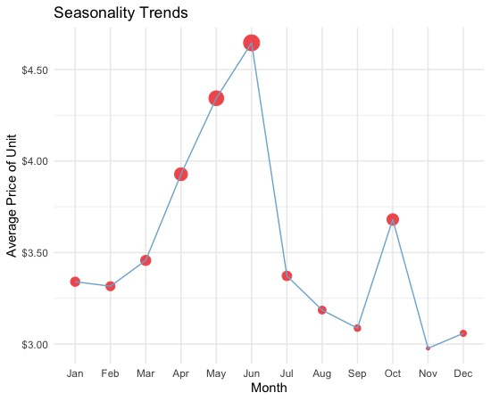

# Ecommerce-EDA
An exploratory data analysis of E-Commerce data provided graciously by the UCI Machine Learning Repository

Load required libraries and load data
```
library(readr)
library(dplyr)
library(ggplot2)
library(DataExplorer)
library(lubridate)

data<-read.csv("ecomm.csv")
```
```
data <- na.omit(data)
dim(data)
```

> [1] [406829]      [8]
Check and remove observations with NA values as they are not useful for our analysis. Were left with:

405829 Observations
8 Columns

## Data cleanup
We first need to reformat and reorganize some columns. We'll use the InvoiceDate column to generate extradate/time related data for analysis
```
data$Date<-as.Date(data$InvoiceDate, format="%m/%d/%Y") #Reformat to date variable
data$month<-format(data$Date, "%m") #extract month value
data$year<-format(data$Date, "%Y") #extract year value
data$Time<-format(strptime(data$InvoiceDate,"%m/%d/%Y %H:%M"),'%H:%M') #Exract POSIXct time value
data$hours<-format(strptime(data$Time,"%H:%M"),'%H') #Extract hour time
```
We'll also generate the day of the week that each observation falls on, giving us a better insight into consumer behavior.
```
data$dow<-weekdays(as.POSIXct(data$Date), abbreviate = F)
data$dow<-as.factor(data$dow)
data$dow <- ordered(data$dow, levels=c("Monday", "Tuesday", "Wednesday", "Thursday", 
                                         "Friday", "Saturday", "Sunday"))
```

## Date/Time exploration
**Lets start by looking a time series of total revenue:**


We can see a noticeable pattern of consistent linear growth, with some very large spikes later in the year. October 2011 has an extremely large spike, which will be interesting to explore later on. Unfortunately we only have one years worth of data, and it would be interesting to see if sales dipped again in January of 2012, and then rose similarly to the way they did in 2011.
### Seasonality
  

When looking into the seasonality of these e-commerce sales, we interestingly can see a significant spike in average unit price from April-July, and then a quick downard trend right after. It's unclear to me why unit prices are so high in these months, but its clear that there is an obvious seasonality trend.

There is a smaller spike in October as well.

Similarly, we see a clear increase in e-commerce revenue from October-December. One explanation for this would be the increased gift buying around the major holidays of the winter months.

### Day/Time


We see the most highest revenue of sales coming on Wednesday of all days. In fact the beginning of the week (Mon-Wed) has the highest revenue of sales, and the weekend has the lowest revenue. This trend is the opposite of what I would have expected. Based on my own consumer habits, I would think people would be much more likely to online shop on the weekend.


Looking closer, we see the most transactions occuring in the middle of the day, and slowly decreasing as the day goes on. I believe this is due to midday having the most shoppers being awake and alert.

## Regional Exploration

Looking at the Top 6 countries by average revenue. We can begin to understand how region affects seasonality. For example, USA shows the most intense relative spike in revenue during the winter months due to the increase in spending for the winter holidays. This revenue spike is related to American culture, and the data backs it up. Similarly we see intense spikes in the UK and Australia, who both widely celebrate the winter holidays. 

However, the Netherlands shows the highest average revenue of all countries in the winter months, however I believe this is because the dataset is focused on European E-Commerce. Its difficult to understand who the products are being marketed towards, and where the companies who make these products come from.


## RFM (Recency, Frequency, Monetary) Analysis
## Sales Forecast
